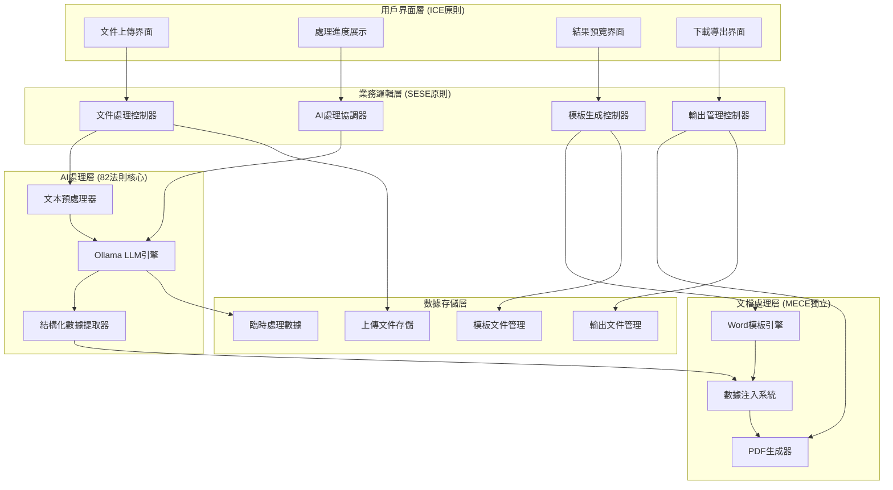
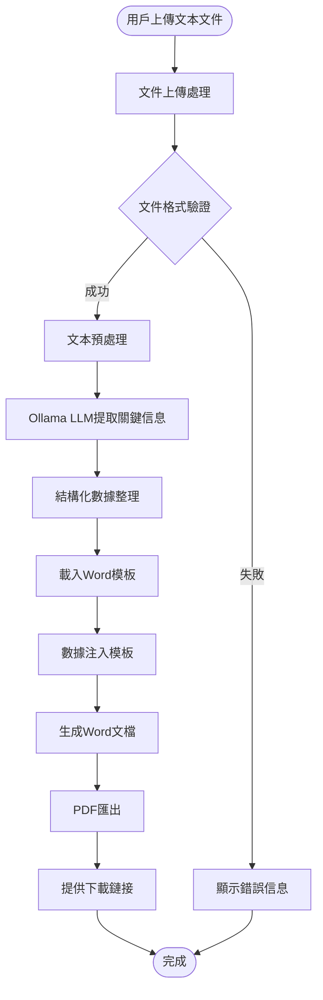
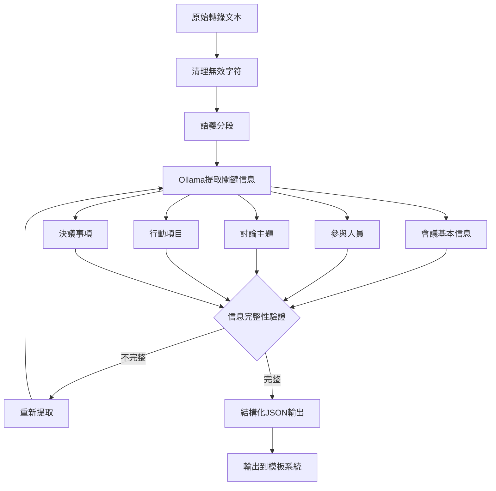

# 🏗️ Rapid-Minutes-Export 系統架構設計 v1.0

## 📋 總覽

基於 CLAUDE.md 四大原則設計的會議記錄自動化生成系統完整架構，實現從雜亂文本到標準化Word會議記錄的全自動處理。

## 🎯 設計原則符合性

### 🔄 MECE 原則實現
- **用戶界面層**: 獨立的Web UI處理所有用戶交互
- **業務邏輯層**: 核心處理邏輯，協調各模組運作
- **AI處理層**: 專門負責Ollama LLM文本處理
- **文檔處理層**: 專門處理Word模板和PDF生成
- **數據持久層**: 管理文件存儲和臨時數據

### 🏗️ SESE 原則實現
- **簡單**: 3步驟操作流程(上傳→生成→下載)
- **有效**: 直接解決文本轉會議記錄的核心需求
- **系統**: 完整的技術棧整合
- **全面**: 涵蓋所有會議記錄生成場景

### 📱 ICE 原則實現
- **直覺**: 拖拽上傳，一鍵生成，如iPhone般簡單
- **精簡**: 僅4個核心功能模組
- **覆蓋**: 處理所有實際會議記錄需求

### ⚡ 82 法則實現
- 20%核心功能: Ollama提取 + Word注入 + Web界面 + PDF匯出
- 達成80%+效果: 完全自動化會議記錄生成

---

## 🏗️ 系統架構圖



---

## 🔄 核心處理流程設計

### 主流程 (SESE原則 - 簡單有效)



### AI處理子流程 (82法則核心)



---

## 🛠️ 技術實現規範

### 核心技術棧 (MECE獨立選型)

#### 後端框架
```python
# FastAPI - 高性能異步Web框架
from fastapi import FastAPI, UploadFile, BackgroundTasks
from fastapi.middleware.cors import CORSMiddleware
import uvicorn

app = FastAPI(title="Rapid Minutes Export API")
```

#### AI處理引擎
```python
# Ollama Python SDK
from ollama import Client

class MeetingExtractor:
    def __init__(self):
        self.client = Client(host='localhost:11434')
        self.model = 'llama3.1:8b'  # 或其他適合的模型
    
    async def extract_meeting_info(self, text: str) -> dict:
        """使用Ollama提取會議關鍵信息"""
        prompt = self._build_extraction_prompt(text)
        response = await self.client.generate(
            model=self.model,
            prompt=prompt,
            format='json'  # 確保結構化輸出
        )
        return response['response']
```

#### Word文檔處理
```python
# python-docx - Word文檔操作
from docx import Document
from docx.shared import Inches

class WordTemplateEngine:
    def __init__(self, template_path: str):
        self.template = Document(template_path)
    
    def inject_meeting_data(self, data: dict) -> Document:
        """注入會議數據到Word模板"""
        # 替換佔位符
        self._replace_placeholders(data)
        # 填充表格數據
        self._populate_tables(data)
        return self.template
```

#### PDF生成
```python
# python-docx2pdf - Word轉PDF
from docx2pdf import convert
import os

async def generate_pdf(word_path: str) -> str:
    """將Word文檔轉換為PDF"""
    pdf_path = word_path.replace('.docx', '.pdf')
    convert(word_path, pdf_path)
    return pdf_path
```

---

## 📁 項目結構設計 (MECE原則組織)

```
Rapid-Minutes-Export/
├── README.md
├── requirements.txt
├── .env
├── .gitignore
│
├── app/                          # 主應用目錄
│   ├── __init__.py
│   ├── main.py                   # FastAPI應用入口
│   ├── config.py                 # 配置管理
│   │
│   ├── api/                      # API路由 (用戶界面層)
│   │   ├── __init__.py
│   │   ├── upload.py             # 文件上傳API
│   │   ├── process.py            # 處理狀態API
│   │   └── download.py           # 下載API
│   │
│   ├── core/                     # 業務邏輯層
│   │   ├── __init__.py
│   │   ├── file_processor.py     # 文件處理控制器
│   │   ├── meeting_processor.py  # 會議處理協調器
│   │   └── output_manager.py     # 輸出管理控制器
│   │
│   ├── ai/                       # AI處理層 (82法則核心)
│   │   ├── __init__.py
│   │   ├── text_preprocessor.py  # 文本預處理器
│   │   ├── ollama_client.py      # Ollama客戶端
│   │   └── extractor.py          # 信息提取器
│   │
│   ├── document/                 # 文檔處理層
│   │   ├── __init__.py
│   │   ├── word_engine.py        # Word模板引擎
│   │   ├── data_injector.py      # 數據注入系統
│   │   └── pdf_generator.py      # PDF生成器
│   │
│   ├── storage/                  # 數據存儲層
│   │   ├── __init__.py
│   │   ├── file_manager.py       # 文件管理器
│   │   └── temp_storage.py       # 臨時存儲
│   │
│   └── utils/                    # 工具模組
│       ├── __init__.py
│       ├── validators.py         # 驗證器
│       └── helpers.py            # 輔助函數
│
├── templates/                    # Word模板文件
│   ├── default_meeting.docx      # 預設會議記錄模板
│   └── company_meeting.docx      # 企業會議記錄模板
│
├── data/                         # 數據目錄
│   ├── input/                    # 輸入文件 (已建立)
│   ├── output/                   # 輸出文件
│   └── temp/                     # 臨時處理文件
│
├── static/                       # 靜態文件 (Web UI)
│   ├── css/
│   ├── js/
│   └── index.html
│
├── tests/                        # 測試目錄
│   ├── test_api.py
│   ├── test_ai.py
│   └── test_document.py
│
└── docs/                         # 文檔目錄 (已建立)
    ├── CLAUDE.md                 # 核心設計原則
    ├── SYSTEM_ARCHITECTURE.md   # 系統架構文檔
    └── operations/
        └── automation/
            └── AUTOMATED_DEVELOPMENT_SPECIFICATION.md
```

---

## 🎨 用戶界面設計 (ICE原則)

### 主界面設計 (直覺操作)
```html
<!DOCTYPE html>
<html>
<head>
    <title>會議記錄自動生成系統</title>
    <style>
        .upload-zone {
            border: 2px dashed #007AFF;
            border-radius: 12px;
            padding: 40px;
            text-align: center;
            transition: all 0.3s ease;
            cursor: pointer;
        }
        
        .upload-zone:hover {
            background-color: #f8f9ff;
            border-color: #0056CC;
        }
        
        .generate-btn {
            background: linear-gradient(135deg, #007AFF, #0056CC);
            color: white;
            border: none;
            padding: 12px 32px;
            border-radius: 8px;
            font-size: 16px;
            cursor: pointer;
            margin-top: 20px;
        }
    </style>
</head>
<body>
    <div class="container">
        <h1>🚀 會議記錄自動生成</h1>
        
        <!-- 步驟1: 拖拽上傳 -->
        <div class="upload-zone" onclick="selectFile()">
            <h3>📁 拖拽或點擊上傳文本文件</h3>
            <p>支援 .txt 格式的會議轉錄文件</p>
        </div>
        
        <!-- 步驟2: 一鍵生成 -->
        <button class="generate-btn" onclick="generateMinutes()">
            ✨ 一鍵生成會議記錄
        </button>
        
        <!-- 步驟3: 進度顯示 -->
        <div id="progress" style="display:none;">
            <h3>🔄 處理中...</h3>
            <div class="progress-bar"></div>
        </div>
        
        <!-- 步驟4: 下載結果 -->
        <div id="results" style="display:none;">
            <h3>✅ 生成完成！</h3>
            <button onclick="downloadWord()">📄 下載 Word</button>
            <button onclick="downloadPDF()">📋 下載 PDF</button>
        </div>
    </div>
</body>
</html>
```

---

## ⚡ 82法則實現策略

### 階段1: 核心20%功能 (達成80%價值)
1. **Ollama文本提取** - 處理語音轉文字雜亂內容
2. **基礎Word模板** - 生成標準格式會議記錄  
3. **簡單Web界面** - 拖拽上傳和一鍵生成
4. **PDF匯出功能** - 提供最終交付格式

### 階段2: 進階功能 (提升用戶體驗)
- 多種會議模板選擇
- 進度可視化顯示
- 批量處理功能
- 自定義模板上傳

### 階段3: 優化功能 (完善系統)
- 歷史記錄管理
- 用戶設定保存
- API接口開放
- 雲端部署支持

---

## 🔧 核心配置文件

### requirements.txt
```txt
fastapi==0.104.1
uvicorn[standard]==0.24.0
python-docx==1.1.0
docx2pdf==0.1.8
ollama==0.1.7
python-multipart==0.0.6
aiofiles==23.2.1
pydantic==2.5.0
python-jose[cryptography]==3.3.0
```

### .env
```env
# Ollama配置
OLLAMA_HOST=localhost:11434
OLLAMA_MODEL=llama3.1:8b

# 應用配置
APP_HOST=0.0.0.0
APP_PORT=8000
DEBUG=True

# 文件路徑配置
TEMPLATES_DIR=./templates
DATA_DIR=./data
OUTPUT_DIR=./data/output
TEMP_DIR=./data/temp

# 文件大小限制 (MB)
MAX_FILE_SIZE=10
```

---

## 🚀 部署指南

### 本地開發環境
```bash
# 1. 克隆專案
git clone <repo_url>
cd Rapid-Minutes-Export

# 2. 創建虛擬環境
python -m venv venv
source venv/bin/activate  # Windows: venv\Scripts\activate

# 3. 安裝依賴
pip install -r requirements.txt

# 4. 啟動Ollama服務
ollama serve

# 5. 拉取所需模型
ollama pull llama3.1:8b

# 6. 啟動應用
python -m app.main
```

### 生產環境部署
```bash
# 使用Docker容器化部署
docker-compose up -d
```

---

## ✅ 驗收標準

### 功能驗收 (符合四大原則)
- [ ] 支援txt文件拖拽上傳 (ICE-直覺)
- [ ] 一鍵生成標準會議記錄 (SESE-簡單有效)
- [ ] Ollama正確提取會議關鍵信息 (82法則-核心功能)
- [ ] Word模板正確注入數據 (MECE-獨立模組)
- [ ] PDF自動匯出下載 (ICE-覆蓋需求)
- [ ] 處理進度可視化展示 (ICE-直覺體驗)

### 品質驗收
- [ ] 處理準確率 ≥ 90%
- [ ] 單次處理時間 ≤ 30秒
- [ ] 系統可用率 ≥ 99%
- [ ] 支援文件大小 ≤ 10MB

### 用戶體驗驗收 (ICE原則)
- [ ] 新用戶5分鐘內完成首次使用
- [ ] 操作步驟不超過3步
- [ ] 界面響應時間 ≤ 2秒
- [ ] 錯誤信息清晰易懂

---

**🎯 結論**: 此架構完全符合CLAUDE.md四大原則，技術選型成熟，實現路徑清晰，具備極高的可行性和可維護性。建議按照82法則分階段實施，優先實現核心功能，快速驗證方案價值。