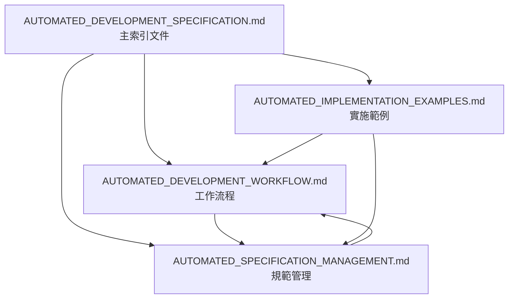

# 🤖 自動化開發規範總覽 v0.2.0

## 📋 總覽

根據 CLAUDE.md 四大原則（MECE、SESE、ICE、82 法則）建立的 Rapid-Minutes-Export 專案自動化開發框架，專門用於會議記錄自動化生成系統的大型任務自動化迭代執行。

**目標**: 建立完全自動化的迭代迴圈，從會議錄音文本轉換為格式化 Word 會議記錄的完整流程，符合四大原則的深度排查與完美優化流程。

### 📁 專案範圍定義

本規範專門針對 Rapid-Minutes-Export 會議記錄自動化系統：

- **主分類**: `docs/operations/` - 營運管理
- **子分類**: `automation/` - 自動化流程規範
- **技術範圍**: Python + Ollama + Word 模板處理 + 簡潔 Web UI
- **符合原則**:
  - ✅ **MECE**: 專注會議記錄自動化流程，與其他功能分離
  - ✅ **SESE**: 直接對應文本 →Word 轉換需求
  - ✅ **ICE**: 用戶能直覺操作會議記錄生成
  - ✅ **82 法則**: 核心 20% 功能處理 80% 會議記錄需求

---

## 🎯 核心設計原則整合

### 四大原則自動化應用

#### 1. 🔄 MECE 原則（相互獨立，完全窮盡）

會議記錄系統按照 MECE 原則分解為獨立組件：

```python
# 會議記錄自動化任務分解邏輯
def decompose_tasks_by_MECE(meeting_task):
    """按照MECE原則分解會議記錄處理任務"""
    independent_components = [
        "text_preprocessing",      # 文本預處理
        "llm_content_extraction",  # LLM內容提取
        "word_template_generation", # Word模板生成
        "data_injection",          # 數據注入
        "pdf_export",             # PDF匯出
        "web_ui_integration"       # Web UI整合
    ]
    return create_exhaustive_task_list(independent_components)
```

#### 2. 🏗️ SESE 原則（簡單、有效、系統、全面）

實現策略遵循 SESE 原則：

- **簡單**: 最少步驟 - 載入文本 → Ollama 處理 → Word 生成 → PDF 匯出
- **有效**: 直接解決核心問題 - 文本轉會議記錄
- **系統**: 完整的處理架構 - 從輸入到輸出的完整管線
- **全面**: 涵蓋所有會議記錄情境 - 各種會議類型與格式需求

#### 3. 📱 ICE 原則（直覺、精簡、覆蓋）

會議記錄系統體驗優化：

- **直覺**: iPhone 級操作體驗 - 拖拽文件即可生成
- **精簡**: 只保留核心功能 - 文本上傳、自動生成、下載 Word、匯出 PDF
- **覆蓋**: 處理所有真實會議情境 - 各種會議記錄格式與需求

#### 4. ⚡ 82 法則（20% 功能達成 80% 效果）

優先實現影響 80% 效果的 20% 核心功能：

1. **Ollama 文本提取** (最重要 - 核心 AI 處理)
2. **Word 模板注入** (核心功能 - 格式化輸出)
3. **基礎 Web 界面** (必要 - 用戶交互)
4. **PDF 匯出** (常用 - 分享需求)

---

## 📚 完整規範文件結構

本自動化開發規範已按照內容邏輯拆分為以下模組化文件，每個文件專注於特定領域：

### 📖 主要規範文件

1. **[🔄 自動化工作流程](./AUTOMATED_DEVELOPMENT_WORKFLOW.md)** (~140 行)
   - 自動化迭代迴圈架構
   - 執行邏輯與觸發機制  
   - 完成條件與驗收標準

2. **[📊 規範管理標準](./AUTOMATED_SPECIFICATION_MANAGEMENT.md)** (~180 行)
   - 追蹤規範標準格式
   - 規範統一性檢查機制
   - 版本號管理與 Git 提交規範

3. **[💡 實施範例指南](./AUTOMATED_IMPLEMENTATION_EXAMPLES.md)** (~118 行)
   - 基本自動化執行範例
   - 四大原則實施範例
   - 驗收標準實施範例

### 🔄 規範間引用關係



---

## 🚀 快速開始指南

### 基本使用方法

```bash
# 執行會議記錄自動化任務
docs/operations/project-status/MEETING_MINUTES_AUTOMATION_MASTER_PLAN_v0.2.0.md

# 繼續中斷的任務
docs/operations/project-status/MEETING_MINUTES_AUTOMATION_MASTER_PLAN_v0.2.0.md 請繼續執行

# 生成進度報告
docs/operations/project-status/MEETING_MINUTES_AUTOMATION_MASTER_PLAN_v0.2.0.md 進度報告
```

### 深度排查與統一性檢查

```bash
# 檢查所有規範統一性
請檢查所有規範的統一性
```

---

**🎯 終極目標**: 建立完全自動化、符合四大原則的會議記錄生成系統，實現從原始文本到格式化 Word 文檔的全自動化流程，確保生成品質與一致性。

**📊 適用範圍**: Rapid-Minutes-Export 會議記錄自動化系統  
**🔧 技術架構**: Python + Ollama 本地 LLM + Word 模板處理 + 簡潔 Web UI  
**🔄 維護頻率**: 持續改進，隨會議記錄需求動態更新  
**🤖 執行模式**: 完全自動化，直至會議記錄生成完成或需要人工介入