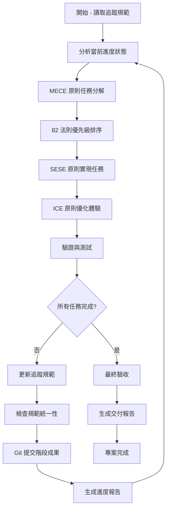

# 🤖 自動化迭代開發規範 v1.0.0

## 📋 總覽

根據 CLAUDE.md 四大原則（MECE、SESE、ICE、82 法則）建立的 Rapid-Minutes-Export 專案自動化開發框架，專門用於會議記錄自動化生成系統的大型任務自動化迭代執行。

**目標**: 建立完全自動化的迭代迴圈，從會議錄音文本轉換為格式化 Word 會議記錄的完整流程，符合四大原則的深度排查與完美優化流程。

### 📁 文檔分類規範符合性

本文檔專門針對 Rapid-Minutes-Export 會議記錄自動化系統：

- **主分類**: `docs/operations/` - 營運管理
- **子分類**: `automation/` - 自動化流程規範
- **技術範圍**: Python + Ollama + Word 模板處理 + 簡潔 Web UI
- **符合原則**:
  - ✅ **MECE**: 專注會議記錄自動化流程，與其他功能分離
  - ✅ **SESE**: 直接對應文本 →Word 轉換需求
  - ✅ **ICE**: 用戶能直覺操作會議記錄生成
  - ✅ **82 法則**: 核心 20% 功能處理 80% 會議記錄需求

---

## 🎯 核心設計原則整合

### 四大原則自動化應用

#### 1. 🔄 MECE 原則（相互獨立，完全窮盡）

```python
# 會議記錄自動化任務分解邏輯
def decompose_tasks_by_MECE(meeting_transcription_task):
    """按照MECE原則分解會議記錄處理任務"""
    # 1. 識別所有獨立處理組件
    independent_components = [
        "text_preprocessing",      # 文本預處理
        "llm_content_extraction",  # LLM內容提取
        "word_template_generation", # Word模板生成
        "data_injection",          # 數據注入
        "pdf_export",             # PDF匯出
        "web_ui_integration"       # Web UI整合
    ]

    # 2. 確保無重疊、無遺漏
    validate_no_overlap_no_gap(independent_components)

    # 3. 建立完全窮盡的任務清單
    return create_exhaustive_task_list(independent_components)
```

#### 2. 🏗️ SESE 原則（簡單、有效、系統、全面）

```python
# 會議記錄處理自動化實現策略
def apply_SESE_to_implementation(task_list):
    """按照SESE原則實現會議記錄自動化"""
    # 簡單: 最少步驟達成目標
    simplified_steps = [
        "load_text_file",          # 載入文本文件
        "extract_with_ollama",     # 使用Ollama提取關鍵信息
        "generate_word_template",  # 生成Word模板
        "inject_data_to_word",     # 注入數據到Word
        "export_pdf"               # 匯出PDF
    ]

    # 有效: 直接解決核心問題 - 文本轉會議記錄
    effective_solutions = focus_on_meeting_minutes_generation(simplified_steps)

    # 系統: 完整的處理架構
    systematic_approach = build_ollama_word_pipeline(effective_solutions)

    # 全面: 涵蓋所有會議記錄情境
    return cover_all_meeting_scenarios(systematic_approach)
```

#### 3. 📱 ICE 原則（直覺、精簡、覆蓋）

```python
# 會議記錄系統體驗優化
def optimize_by_ICE(implementation):
    """按照ICE原則優化會議記錄生成體驗"""
    # 直覺: iPhone級操作體驗 - 拖拽文件即可生成
    intuitive_interface = {
        "drag_and_drop_upload": True,     # 拖拽上傳文本文件
        "one_click_generation": True,     # 一鍵生成會議記錄
        "progress_visualization": True,    # 可視化處理進度
        "instant_preview": True           # 即時預覽結果
    }

    # 精簡: 只保留必要功能
    concise_features = [
        "text_upload",        # 文本上傳
        "auto_generate",      # 自動生成
        "download_word",      # 下載Word
        "export_pdf"          # 匯出PDF
    ]

    # 覆蓋: 處理所有真實會議情境
    return ensure_complete_meeting_coverage(concise_features)
```

#### 4. ⚡ 82 法則（20% 功能達成 80% 效果）

```python
# 會議記錄系統優先級排序
def prioritize_by_82_rule(tasks):
    """按照82法則優先實現核心功能"""
    # 識別影響 80% 效果的 20% 核心功能
    core_20_percent = [
        "ollama_text_extraction",    # Ollama文本提取 (最重要)
        "word_template_injection",   # Word模板注入 (核心功能)
        "basic_web_interface",      # 基礎Web界面 (必要)
        "pdf_export"                # PDF匯出 (常用)
    ]

    # 優先實現核心功能
    priority_implementation = implement_priority_first(core_20_percent)

    # 用最小成本達成最大效果
    return achieve_maximum_meeting_impact(priority_implementation)
```

---

## 🔄 自動化迭代迴圈架構

### 核心迴圈流程



### 自動化執行邏輯

#### 主迴圈控制器

```javascript
async function automated_development_loop(tracking_spec_path) {
  // 1. 初始化
  let tracking_spec = await load_tracking_specification(tracking_spec_path);
  let automation_rules = await load_automation_rules();
  let project_principles = await load_claude_md_principles();

  // 2. 主迭代迴圈
  while (!all_tasks_completed(tracking_spec)) {
    // 2.1 狀態分析
    let current_progress = analyze_current_progress(tracking_spec);

    // 2.2 MECE 原則任務分解
    let decomposed_tasks = decompose_tasks_by_MECE(
      current_progress.pending_tasks
    );

    // 2.3 82 法則優先級排序
    let prioritized_tasks = prioritize_by_82_rule(decomposed_tasks);

    // 2.4 SESE 原則實現任務
    let implementation_results = await implement_tasks_by_SESE(
      prioritized_tasks
    );

    // 2.5 ICE 原則體驗優化
    let optimized_results = optimize_by_ICE(implementation_results);

    // 2.6 驗證與測試
    let validation_results = await validate_and_test(optimized_results);

    // 2.7 更新追蹤規範
    tracking_spec = await update_tracking_specification(
      tracking_spec,
      validation_results
    );

    // 2.8 檢查規範統一性
    await ensure_specification_consistency(tracking_spec);

    // 2.9 版本控制提交
    await git_commit_stage_results(validation_results);

    // 2.10 生成進度報告
    await generate_progress_report(tracking_spec);
  }

  // 3. 最終交付
  let final_deliverable = await final_acceptance_and_delivery(tracking_spec);
  return final_deliverable;
}
```

---

## 📊 追蹤規範標準格式

### 追蹤規範模板結構

每個大型任務必須建立符合以下格式的追蹤規範：

```markdown
# 🎯 [任務名稱]大型任務追蹤清單 v1.0.0

## 📋 總覽

根據 CLAUDE.md 四大原則建立的系統性任務追蹤...

## 🗺️ 任務完整分析 (MECE 原則分解)

[按照 MECE 原則完全分解的任務清單]

## 🎯 詳細任務清單與執行狀態

[具體任務表格，包含狀態追蹤]

## 📊 進度統計

[量化進度指標]

## 🎯 階段化執行計劃 (82 法則優先級)

[按照 82 法則排序的執行階段]

## 🛠️ 實現標準 (SESE 原則)

[簡單、有效、系統、全面的實現標準]

## 🧪 驗收測試標準 (ICE 原則)

[直覺、精簡、覆蓋的測試標準]

## 🤖 自動化對話接軌指南

[一句話繼續執行指令與自動化協議]

## 🚀 當前執行狀態

[實時進度追蹤區塊]
```

### 必要引用規範

每個追蹤規範必須包含以下引用：

```markdown
## 📚 規範引用

本追蹤規範遵循以下核心規範：

- **[自動化開發規範](../../operations/automation/AUTOMATED_DEVELOPMENT_SPECIFICATION_v1.0.0.md)** - 自動化迭代流程
- **[專案總規範](../../../CLAUDE.md)** - 四大原則與深度優化流程
- **[相關技術規範]** - 任務特定的技術規範

### 自動化執行協議

本追蹤規範支持完全自動化執行，遵循 [自動化開發規範](../../operations/automation/AUTOMATED_DEVELOPMENT_SPECIFICATION_v1.0.0.md) 定義的迭代迴圈流程。
```

---

## 🎮 自動化觸發機制

### 標準觸發指令格式

#### 基本自動化執行

```bash
# 完全自動化執行（推薦）
[追蹤規範路徑]

# 繼續特定任務（手動介入後繼續自動化）
[追蹤規範路徑] 請繼續執行

# 從特定階段開始
[追蹤規範路徑] 從階段 [N] 開始執行

# 執行特定優先級任務
[追蹤規範路徑] 執行 P0 高優先級任務
```

#### 進度查詢指令

```bash
# 生成當前進度報告
[追蹤規範路徑] 進度報告

# 生成最終驗收報告
[追蹤規範路徑] 最終驗收報告

# 檢查規範統一性
[追蹤規範路徑] 檢查統一性
```

### Claude 自動判斷邏輯

```javascript
function parse_automation_command(user_input) {
  let tracking_spec_path = extract_tracking_spec_path(user_input);

  if (!tracking_spec_path) {
    return { type: "normal_conversation" };
  }

  if (user_input.includes("請繼續執行") || user_input.includes("請繼續修復")) {
    return {
      type: "continue_automation",
      spec_path: tracking_spec_path,
      mode: "continue",
    };
  }

  if (user_input.includes("從階段")) {
    let stage = extract_stage_number(user_input);
    return {
      type: "stage_specific_automation",
      spec_path: tracking_spec_path,
      stage: stage,
    };
  }

  if (user_input.includes("進度報告")) {
    return {
      type: "progress_report",
      spec_path: tracking_spec_path,
    };
  }

  if (user_input.includes("最終驗收報告")) {
    return {
      type: "final_acceptance_report",
      spec_path: tracking_spec_path,
    };
  }

  // 預設：完全自動化執行
  return {
    type: "full_automation",
    spec_path: tracking_spec_path,
  };
}

async function execute_automation_command(command) {
  switch (command.type) {
    case "full_automation":
      return await automated_development_loop(command.spec_path);

    case "continue_automation":
      return await continue_from_current_progress(command.spec_path);

    case "stage_specific_automation":
      return await execute_specific_stage(command.spec_path, command.stage);

    case "progress_report":
      return await generate_progress_report(command.spec_path);

    case "final_acceptance_report":
      return await generate_final_report(command.spec_path);

    default:
      return await normal_conversation_mode();
  }
}
```

---

## 🔧 規範統一性檢查機制

### 自動統一性驗證

#### 1. 版本號統一性檢查

```javascript
function check_version_consistency() {
  let all_specs = scan_all_specifications();
  let version_map = extract_versions(all_specs);

  // 檢查版本號是否統一為 v1.0.0
  for (let spec of all_specs) {
    if (spec.version !== "v1.0.0") {
      flag_version_inconsistency(spec);
    }
  }
}
```

#### 2. 引用路徑統一性檢查

```javascript
function check_reference_consistency() {
  let all_references = scan_all_references();

  for (let ref of all_references) {
    if (!file_exists(ref.path)) {
      flag_broken_reference(ref);
    }

    if (ref.description !== get_actual_file_purpose(ref.path)) {
      flag_description_mismatch(ref);
    }
  }
}
```

#### 3. 共用函數統一性檢查

```javascript
function check_shared_function_consistency() {
  let shared_functions = scan_shared_functions();

  for (let func of shared_functions) {
    let usages = find_function_usages(func.name);

    // 檢查是否都使用最新版本
    for (let usage of usages) {
      if (usage.version !== func.latest_version) {
        flag_outdated_usage(usage);
      }
    }
  }
}
```

### 自動化修復機制

#### 版本號自動修正

```javascript
async function auto_fix_version_inconsistency() {
  let inconsistent_specs = find_version_inconsistencies();

  for (let spec of inconsistent_specs) {
    await update_spec_version(spec, "v1.0.0");
    await git_commit(`fix: 統一版本號 ${spec.name} 為 v1.0.0`);
  }
}
```

#### 引用路徑自動修正

```javascript
async function auto_fix_reference_inconsistency() {
  let broken_refs = find_broken_references();

  for (let ref of broken_refs) {
    let correct_path = find_correct_path(ref);
    if (correct_path) {
      await update_reference_path(ref, correct_path);
      await git_commit(
        `fix: 修正引用路徑 ${ref.original_path} → ${correct_path}`
      );
    }
  }
}
```

---

## 📈 動態功能審核標準

### API 模擬實現標準

#### 1. 模擬標註格式

```bash
# 上方標註
echo "🔄 [模擬模式] 正在連接 LeoQ API..."
echo "📡 [模擬模式] 發送請求到 /api/v1/whisper/transcribe"

# 模擬處理邏輯
simulate_api_processing() {
    local service_name="$1"
    local endpoint="$2"

    echo "🔄 [模擬模式] ${service_name} API 處理中..."
    sleep 2  # 模擬處理時間
    echo "✅ [模擬模式] ${service_name} API 響應完成"
}

# 下方標註
echo "📋 [模擬模式] 模擬流程完成，實際部署時將整合真實 API"
```

#### 2. 動態數據實現驗證

```bash
# GPU 溫度動態檢測
get_gpu_temperature_dynamic() {
    if command -v nvidia-smi &> /dev/null; then
        nvidia-smi --query-gpu=temperature.gpu --format=csv,noheader,nounits
    else
        echo "模擬溫度: $((RANDOM % 20 + 50))°C [模擬數據]"
    fi
}

# 服務狀態動態檢測
get_service_status_dynamic() {
    local service_name="$1"

    if systemctl is-active --quiet "$service_name"; then
        echo "✅ 運行中"
    else
        echo "❌ 已停止"
    fi
}

# GPU 數量動態檢測
get_gpu_count_dynamic() {
    if command -v nvidia-smi &> /dev/null; then
        nvidia-smi -L | wc -l
    else
        echo "0 [未檢測到 NVIDIA GPU]"
    fi
}
```

### 動態功能驗收標準

#### 每個介面必須通過的動態檢查

1. **硬體數據動態性**: 溫度、GPU 使用率等真實反映硬體狀態
2. **服務狀態即時性**: 服務狀態檢查反映當前實際狀態
3. **系統資源動態性**: CPU、記憶體使用率實時更新
4. **API 模擬完整性**: 所有需要 API 的功能都有完整模擬流程
5. **模擬標註清晰性**: 上下都有明確的模擬標註

#### 自動驗證腳本範例

```bash
#!/bin/bash
# 動態功能自動驗證腳本

verify_dynamic_functionality() {
    local interface_name="$1"
    local test_results=()

    echo "🧪 驗證介面 ${interface_name} 動態功能..."

    # 檢查硬體數據是否動態
    if check_hardware_data_dynamic "$interface_name"; then
        test_results+=("✅ 硬體數據動態性通過")
    else
        test_results+=("❌ 硬體數據非動態")
    fi

    # 檢查服務狀態是否即時
    if check_service_status_realtime "$interface_name"; then
        test_results+=("✅ 服務狀態即時性通過")
    else
        test_results+=("❌ 服務狀態非即時")
    fi

    # 檢查 API 模擬是否完整
    if check_api_simulation_complete "$interface_name"; then
        test_results+=("✅ API 模擬完整性通過")
    else
        test_results+=("❌ API 模擬不完整")
    fi

    # 輸出結果
    printf '%s\n' "${test_results[@]}"
}
```

---

## 🔄 版本號管理規範

### 版本號標準格式

#### 統一版本號格式：`v1.0.0`

**當前統一標準**:

- 所有追蹤規範：`v1.0.0`
- 所有技術規範：`v1.0.0`
- 所有實現標準：`v1.0.0`

**版本號升級條件**:

- `v0.2.x`: 小幅修正、優化
- `v0.x.0`: 功能新增、結構調整
- `vx.0.0`: 重大架構改變、里程碑達成

### 版本號更新自動化

#### 自動版本檢查腳本

```bash
#!/bin/bash
# 版本號統一檢查與修正腳本

check_and_fix_version_consistency() {
    local target_version="v1.0.0"
    local files_to_check=(
        "docs/operations/project-status/CLI_INTERFACE_UNIFICATION_MASTER_PLAN_v*.md"
        "docs/development/cli-system/implementation/CLI_ERROR_HANDLING_MASTER_PLAN_v*.md"
        "docs/operations/automation/AUTOMATED_DEVELOPMENT_SPECIFICATION_v*.md"
    )

    for pattern in "${files_to_check[@]}"; do
        for file in $pattern; do
            if [[ -f "$file" ]]; then
                # 檢查文件標題版本號
                local current_version=$(grep -oP 'v\d+\.\d+\.\d+' "$file" | head -1)

                if [[ "$current_version" != "$target_version" ]]; then
                    echo "🔧 修正版本號: $file ($current_version → $target_version)"

                    # 更新文件標題版本號
                    sed -i "s/$current_version/$target_version/g" "$file"

                    # 重新命名文件
                    local new_filename=$(echo "$file" | sed "s/$current_version/$target_version/g")
                    if [[ "$file" != "$new_filename" ]]; then
                        mv "$file" "$new_filename"
                        echo "📝 重新命名: $file → $new_filename"
                    fi
                fi
            fi
        done
    done
}
```

### 版本升級策略

#### 何時升級版本號

```javascript
function should_upgrade_version(changes) {
  // v0.2.x - 小幅修正
  if (changes.type === "bug_fix" || changes.type === "minor_optimization") {
    return increment_patch_version();
  }

  // v0.x.0 - 功能新增
  if (
    changes.type === "feature_addition" ||
    changes.type === "structure_adjustment"
  ) {
    return increment_minor_version();
  }

  // vx.0.0 - 重大架構改變
  if (
    changes.type === "major_refactor" ||
    changes.type === "milestone_achievement"
  ) {
    return increment_major_version();
  }

  return maintain_current_version();
}
```

---

## 🚀 Git 提交規範

### 提交訊息格式標準

根據專案既有 commit 格式分析，採用以下英文提交格式：

```bash
# 功能新增
git commit -m "Establish automated development specification for iterative execution

🤖 Generated with [Claude Code](https://claude.ai/code)

Co-Authored-By: Claude <noreply@anthropic.com>"

# 錯誤修復
git commit -m "fix: Unify version numbers across all tracking specifications

Update all tracking specifications to v1.0.0 for consistency

🤖 Generated with [Claude Code](https://claude.ai/code)

Co-Authored-By: Claude <noreply@anthropic.com>"

# 規範更新
git commit -m "Update automated development specification v1.0.0

Add dynamic functionality audit standards and API simulation implementation guidelines

🤖 Generated with [Claude Code](https://claude.ai/code)

Co-Authored-By: Claude <noreply@anthropic.com>"

# 介面優化
git commit -m "Refine and optimize tracking specification format standards

Reorganize tracking specification structure according to MECE principles

🤖 Generated with [Claude Code](https://claude.ai/code)

Co-Authored-By: Claude <noreply@anthropic.com>"

# 複合變更（重大變更時使用）
git commit -m "Unified handling mechanism for automated development workflows | Update Git commit format standards

Establish complete automation loop for development tasks | Align commit format with existing project conventions

🤖 Generated with [Claude Code](https://claude.ai/code)

Co-Authored-By: Claude <noreply@anthropic.com>"
```

### 提交格式模式分析

基於專案 git log 分析，識別出三種標準格式：

#### 1. 簡潔描述型（推薦，80% 使用）

```bash
# 格式: 動詞 + 簡潔描述
"Establish the S1 interface to automatically detect installation rate"
"Unified handling mechanism for unexpected content values input"
"Refine and optimize the M121 interface"
```

#### 2. 標準化前綴型（特定情況）

```bash
# 格式: type: 描述
"fix: Select all interface parameters directly to enter corresponding menu"
```

#### 3. 複合描述型（複雜變更）

```bash
# 格式: 主要變更 | 次要變更
"Major change description | Secondary change description"
```

### 自動提交腳本

```bash
#!/bin/bash
# Automated Git commit script following project conventions

automated_git_commit() {
    local commit_type="$1"
    local description="$2"
    local details="$3"

    # Check for changes
    if [[ -z $(git status --porcelain) ]]; then
        echo "ℹ️  No changes to commit"
        return 0
    fi

    # Add all relevant changes
    git add .

    # Generate commit message based on type
    local commit_msg
    if [[ "$commit_type" == "fix" ]]; then
        commit_msg=$(cat <<EOF
fix: ${description}

${details}

🤖 Generated with [Claude Code](https://claude.ai/code)

Co-Authored-By: Claude <noreply@anthropic.com>
EOF
)
    else
        commit_msg=$(cat <<EOF
${description}

${details}

🤖 Generated with [Claude Code](https://claude.ai/code)

Co-Authored-By: Claude <noreply@anthropic.com>
EOF
)
    fi

    # Execute commit
    git commit -m "$commit_msg"

    echo "✅ Automated commit completed: ${description}"
}
```

---

## 📚 現有追蹤規範整合

### 已建立的追蹤規範

#### 1. CLI 介面統一化追蹤規範

- **路徑**: `AI-Env-CLI/docs/operations/project-status/CLI_INTERFACE_UNIFICATION_MASTER_PLAN_v1.0.0.md`
- **狀態**: 已完成
- **範圍**: 35 個介面統一化

#### 2. CLI 錯誤處理追蹤規範

- **路徑**: `docs/development/cli-system/implementation/CLI_ERROR_HANDLING_MASTER_PLAN_v1.0.0.md`
- **狀態**: 需修正版本號為 v1.0.0
- **範圍**: 29 個介面錯誤處理機制

### 新建追蹤規範需求

基於您的需求分析，需要新建：

#### 3. CLI 動態功能審核追蹤規範

- **建議路徑**: `AI-Env-CLI/docs/operations/project-status/CLI_DYNAMIC_FUNCTIONALITY_AUDIT_PLAN_v1.0.0.md`
- **範圍**:
  - 所有介面動態數據實現審核
  - LeoQ API 模擬完整性驗證
  - 硬體狀態即時檢測驗證
  - 服務狀態動態更新驗證

#### 追蹤規範引用更新

```markdown
## 📚 相關追蹤規範

本自動化規範支持以下追蹤規範的自動化執行：

- **[CLI 介面統一化追蹤](../../../AI-Env-CLI/docs/operations/project-status/CLI_INTERFACE_UNIFICATION_MASTER_PLAN_v1.0.0.md)** - 介面規範符合性統一化
- **[CLI 錯誤處理追蹤](../../development/cli-system/implementation/CLI_ERROR_HANDLING_MASTER_PLAN_v1.0.0.md)** - 統一防呆機制實現
- **[CLI 動態功能審核追蹤](../../../AI-Env-CLI/docs/operations/project-status/CLI_DYNAMIC_FUNCTIONALITY_AUDIT_PLAN_v1.0.0.md)** - 動態功能與 API 模擬審核

### 新追蹤規範建立流程

使用本自動化規範建立新的追蹤規範時：

1. 複製標準追蹤規範模板
2. 按照 MECE 原則分解任務
3. 遵循 82 法則排序優先級
4. 實現 SESE 原則的實現標準
5. 應用 ICE 原則的驗收標準
6. 建立自動化對話接軌指南
```

---

## 💡 使用範例

### 基本自動化執行範例

```bash
# 場景1: 開發者想繼續 CLI 介面統一化任務
用戶輸入:
AI-Env-CLI/docs/operations/project-status/CLI_INTERFACE_UNIFICATION_MASTER_PLAN_v1.0.0.md

Claude 自動執行:
✅ 讀取追蹤規範
✅ 識別當前進度 (已完成 35/35)
✅ 判斷任務已完成
✅ 生成最終交付報告

# 場景2: 開發者想修復錯誤處理機制
用戶輸入:
docs/development/cli-system/implementation/CLI_ERROR_HANDLING_MASTER_PLAN_v1.0.0.md 請繼續修復

Claude 自動執行:
✅ 讀取追蹤規範
✅ 識別當前進度 (已完成 29/29)
✅ 檢查版本號統一性
✅ 發現版本號不一致問題
✅ 自動修正版本號為 v1.0.0
✅ Git 提交修正結果

# 場景3: 建立新的動態功能審核任務
用戶輸入:
需要審核所有介面的動態功能是否正常運作

Claude 自動執行:
✅ 分析需求
✅ 判斷需要新的追蹤規範
✅ 按照本自動化規範模板建立追蹤規範
✅ 開始執行動態功能審核任務
✅ 自動化迭代直至完成
```

### 深度排查與優化範例

```bash
# 場景4: 系統性檢查所有規範統一性
用戶輸入:
請檢查所有規範的統一性

Claude 深度排查流程:
✅ 掃描所有追蹤規範
✅ 檢查版本號一致性
✅ 驗證引用路徑正確性
✅ 確認共用函數最新化
✅ 檢查規範格式標準化
✅ 自動修復發現的問題
✅ 生成統一性檢查報告
✅ Git 提交所有修正
```

---

## 🎯 完成條件與驗收標準

### 自動化迴圈停止條件

迴圈將在以下情況自動停止：

```javascript
function should_stop_automation_loop(tracking_spec) {
  // 1. 所有任務標記為完成
  if (all_tasks_marked_completed(tracking_spec)) {
    return true;
  }

  // 2. 達到最大迭代次數（防止無限迴圈）
  if (iteration_count > MAX_ITERATIONS) {
    generate_timeout_report();
    return true;
  }

  // 3. 遇到無法自動解決的阻塞問題
  if (has_blocking_issues_requiring_human_intervention(tracking_spec)) {
    generate_intervention_required_report();
    return true;
  }

  return false;
}
```

### 最終驗收標準

完成的任務必須滿足：

#### 1. MECE 原則驗收

- ✅ 所有任務相互獨立，無重疊
- ✅ 所有需求完全涵蓋，無遺漏
- ✅ 分類邏輯清晰且有意義

#### 2. SESE 原則驗收

- ✅ 實現方案簡單易懂
- ✅ 直接有效解決核心問題
- ✅ 具備完整系統性設計
- ✅ 全面覆蓋使用情境

#### 3. ICE 原則驗收

- ✅ iPhone 級直覺操作體驗
- ✅ 功能精簡無冗餘
- ✅ 完整覆蓋真實使用需求

#### 4. 82 法則驗收

- ✅ 核心 20% 功能已優先實現
- ✅ 達成 80%+ 的使用效果
- ✅ 資源投入產出比最佳化

#### 5. 統一性驗收

- ✅ 版本號統一為 v1.0.0
- ✅ 引用路徑全部正確
- ✅ 共用函數使用最新版本
- ✅ 代碼與規範完全一致

---

**🎯 終極目標**: 建立完全自動化、符合四大原則的會議記錄生成系統，實現從原始文本到格式化 Word 文檔的全自動化流程，確保生成品質與一致性。

**📊 適用範圍**: Rapid-Minutes-Export 會議記錄自動化系統
**🔧 技術架構**: Python + Ollama 本地 LLM + Word 模板處理 + 簡潔 Web UI
**🔄 維護頻率**: 持續改進，隨會議記錄需求動態更新
**🤖 執行模式**: 完全自動化，直至會議記錄生成完成或需要人工介入
