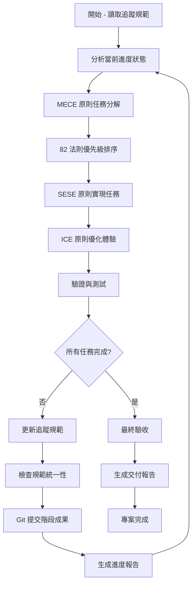

# 🔄 自動化開發工作流程 v0.2.0

## 🔄 自動化迭代迴圈架構

### 核心迴圈流程



### 自動化執行邏輯

#### 主迴圈控制器

```javascript
async function automated_development_loop(tracking_spec_path) {
  // 1. 初始化
  let tracking_spec = await load_tracking_specification(tracking_spec_path);
  let project_principles = await load_claude_md_principles();

  // 2. 主迭代迴圈
  while (!all_tasks_completed(tracking_spec)) {
    // 狀態分析 → MECE 分解 → 82法則排序 → SESE 實現 → ICE 優化
    let current_progress = analyze_current_progress(tracking_spec);
    let decomposed_tasks = decompose_tasks_by_MECE(current_progress.pending_tasks);
    let prioritized_tasks = prioritize_by_82_rule(decomposed_tasks);
    let implementation_results = await implement_tasks_by_SESE(prioritized_tasks);
    let optimized_results = optimize_by_ICE(implementation_results);
    
    // 驗證與更新
    let validation_results = await validate_and_test(optimized_results);
    tracking_spec = await update_tracking_specification(tracking_spec, validation_results);
    await ensure_specification_consistency(tracking_spec);
    await git_commit_stage_results(validation_results);
    await generate_progress_report(tracking_spec);
  }

  // 3. 最終交付
  return await final_acceptance_and_delivery(tracking_spec);
}
```

## 🎮 自動化觸發機制

### 標準觸發指令格式

#### 基本自動化執行

```bash
# 完全自動化執行（推薦）
[追蹤規範路徑]

# 繼續特定任務（手動介入後繼續自動化）
[追蹤規範路徑] 請繼續執行

# 從特定階段開始
[追蹤規範路徑] 從階段 [N] 開始執行

# 執行特定優先級任務
[追蹤規範路徑] 執行 P0 高優先級任務
```

#### 進度查詢指令

```bash
# 生成當前進度報告
[追蹤規範路徑] 進度報告

# 生成最終驗收報告
[追蹤規範路徑] 最終驗收報告

# 檢查規範統一性
[追蹤規範路徑] 檢查統一性
```

### Claude 自動判斷邏輯

```javascript
function parse_automation_command(user_input) {
  let tracking_spec_path = extract_tracking_spec_path(user_input);
  
  if (!tracking_spec_path) {
    return { type: "normal_conversation" };
  }
  
  if (user_input.includes("請繼續執行") || user_input.includes("請繼續修復")) {
    return { type: "continue_automation", spec_path: tracking_spec_path };
  }
  
  if (user_input.includes("進度報告")) {
    return { type: "progress_report", spec_path: tracking_spec_path };
  }
  
  if (user_input.includes("最終驗收報告")) {
    return { type: "final_acceptance_report", spec_path: tracking_spec_path };
  }
  
  // 預設：完全自動化執行
  return { type: "full_automation", spec_path: tracking_spec_path };
}
```

## 🎯 完成條件與驗收標準

### 自動化迴圈停止條件

迴圈將在以下情況自動停止：

```javascript
function should_stop_automation_loop(tracking_spec) {
  // 1. 所有任務標記為完成
  if (all_tasks_marked_completed(tracking_spec)) {
    return true;
  }
  
  // 2. 達到最大迭代次數（防止無限迴圈）
  if (iteration_count > MAX_ITERATIONS) {
    generate_timeout_report();
    return true;
  }
  
  // 3. 遇到無法自動解決的阻塞問題
  if (has_blocking_issues_requiring_human_intervention(tracking_spec)) {
    generate_intervention_required_report();
    return true;
  }
  
  return false;
}
```

### 最終驗收標準

完成的任務必須滿足四大原則驗收：

#### 1. MECE 原則驗收
- ✅ 所有任務相互獨立，無重疊
- ✅ 所有需求完全涵蓋，無遺漏
- ✅ 分類邏輯清晰且有意義

#### 2. SESE 原則驗收
- ✅ 實現方案簡單易懂
- ✅ 直接有效解決核心問題
- ✅ 具備完整系統性設計
- ✅ 全面覆蓋使用情境

#### 3. ICE 原則驗收
- ✅ iPhone 級直覺操作體驗
- ✅ 功能精簡無冗餘
- ✅ 完整覆蓋真實使用需求

#### 4. 82 法則驗收
- ✅ 核心 20% 功能已優先實現
- ✅ 達成 80%+ 的使用效果
- ✅ 資源投入產出比最佳化

#### 5. 統一性驗收
- ✅ 版本號統一為 v0.2.0
- ✅ 引用路徑全部正確
- ✅ 代碼與規範完全一致

## 📚 相關規範

- **[自動化開發規範主檔案](./AUTOMATED_DEVELOPMENT_SPECIFICATION.md)**
- **[規範管理標準](./AUTOMATED_SPECIFICATION_MANAGEMENT.md)**
- **[實施範例指南](./AUTOMATED_IMPLEMENTATION_EXAMPLES.md)**